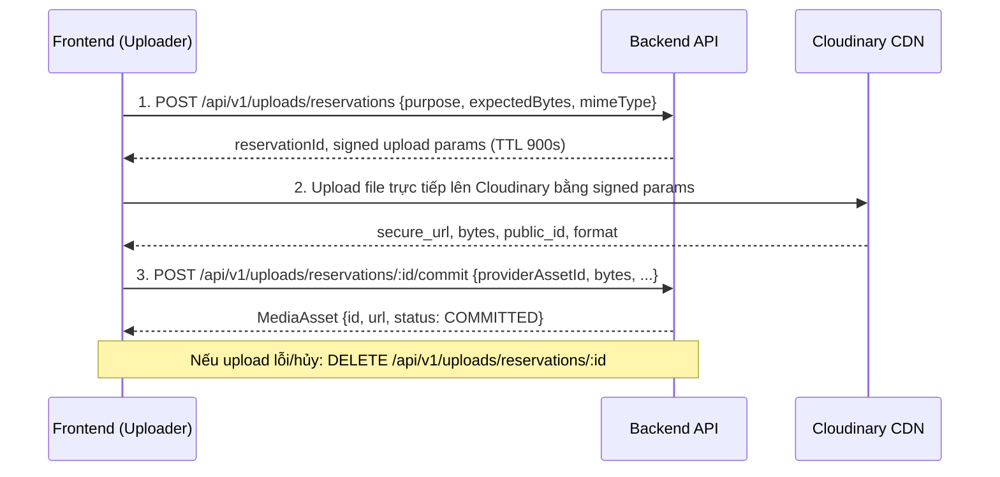

# Task: Phase 15 — Storage Quota & Upload Accounting

> **Tương ứng Backend Prompt**: [`backend/docs/prompts/phase-15-storage-quota.md`](../../../../backend/docs/prompts/phase-15-storage-quota.md)
> **Trạng thái Backend**: `COMPLETED` (READY v4.1, PR #19)
> **Trạng thái Frontend**: `PLANNED` (Cần migrate cấp bách)
> **Mức độ ưu tiên**: 🚨 **CẤP BÁCH — BREAKING CHANGE**

---

## 1. Bối cảnh & Lý do thay đổi

Backend đã chính thức xóa bỏ endpoint cũ `POST /api/v1/uploads/signature` và triển khai cơ chế kiểm soát hạn ngạch lưu trữ (Storage Quota) 1 GiB/user.
Nếu Frontend tiếp tục gọi endpoint signature cũ, người dùng sẽ bị lỗi 404 khi upload ảnh/video.
Frontend bắt buộc phải chuyển sang **luồng Reservation 3 bước** có hạch toán dung lượng bền vững.

### Luồng mới:

---

## 2. Danh sách Endpoints Backend liên quan

Chi tiết xem tại [`frontend/docs/api/storage.md`](../api/storage.md), [`frontend/docs/api/storage-admin.md`](../api/storage-admin.md) và [`frontend/docs/api/uploads.md`](../api/uploads.md):

| Method | Endpoint | Quyền | Mục đích |
|---|---|---|---|
| `GET` | `/api/v1/storage/me` | Member | Xem hạn ngạch: usedBytes, limitBytes, remainingBytes |
| `DELETE` | `/api/v1/storage/assets/:id` | Owner | Xóa vĩnh viễn media asset và giải phóng quota |
| `POST` | `/api/v1/uploads/reservations` | Member | Giữ trước dung lượng và lấy signed upload params |
| `POST` | `/api/v1/uploads/reservations/:id/commit` | Member | Xác nhận đã upload xong lên Cloudinary để tạo MediaAsset |
| `DELETE` | `/api/v1/uploads/reservations/:id` | Member | Hủy reservation khi người dùng hủy hoặc upload lỗi |
| `GET` | `/api/v1/admin/storage/accounts` | Admin | Quản lý hạn mức dung lượng của các tài khoản |
| `GET` | `/api/v1/admin/storage/policies` | Admin | Xem cấu hình chính sách lưu trữ |
| `PATCH` | `/api/v1/admin/storage/policies/:id` | Admin | Cập nhật chính sách lưu trữ |
| `POST` | `/api/v1/admin/storage/accounts/:userId/adjustments` | Admin | Cộng/trừ dung lượng thủ công cho user kèm lý do |
| `GET` | `/api/v1/admin/storage/adjustments` | Admin | Xem lịch sử điều chỉnh dung lượng |

---

## 3. Checklist Chuẩn Bị (Pre-flight Checklist)

- [ ] Đọc tài liệu:
  - [`backend/docs/prompts/phase-15-storage-quota.md`](../../../../backend/docs/prompts/phase-15-storage-quota.md)
  - [`frontend/docs/api/storage.md`](../api/storage.md) & [`frontend/docs/api/uploads.md`](../api/uploads.md)
  - `docs/SRS.md` mục FR-10 (Media & Storage Quota)
- [ ] Kiểm tra hằng số endpoint trong `src/common/constants/api-endpoints.ts`:
  - Khai báo nhánh `STORAGE`: `ME`, `ASSET: (id) => ...`
  - Cập nhật nhánh `UPLOADS`: `RESERVATIONS`, `COMMIT: (id) => ...`, `RELEASE: (id) => ...`
  - Khai báo nhánh `ADMIN_STORAGE`: `ACCOUNTS`, `POLICIES`, `POLICY: (id) => ...`, `ADJUSTMENTS`
- [ ] Xác định mã lỗi nghiệp vụ cần bắt:
  - `STORAGE_QUOTA_EXCEEDED`: Báo vượt quá dung lượng 1 GiB, gợi ý xóa ảnh/video cũ.
  - `UPLOAD_RESERVATION_EXPIRED`: Reservation quá 15 phút (900s), cần xin reservation mới.
  - `UPLOAD_PROVIDER_MISMATCH`: File upload không khớp thông số reservation.
  - `MEDIA_ASSET_IN_USE`: Không cho xóa media đang được công thức/bài viết dùng.

---

## 4. Checklist Triển Khai (7 Tầng Scaffold)

### Tầng 1 & 2: Types DTO & Model
- [ ] Tạo `src/features/storage/types/storage.dto.ts`:
  - `StorageUsageResponseDto`, `CreateUploadReservationRequestDto`, `CreateUploadReservationResponseDto`
  - `CommitUploadReservationRequestDto`, `UploadReservationResponseDto`, `MediaAssetDto`
- [ ] Tạo `src/features/storage/types/storage.model.ts`:
  - `StorageUsage`, `UploadReservation`, `MediaAsset`, `StoragePolicy`

### Tầng 3 & 4: Mapper & Unit Test
- [ ] Tạo `src/features/storage/mappers/storage.mapper.ts`:
  - `toUsageModel()`: format byte sang MB/GB dễ đọc, tính % sử dụng.
  - `toReservationModel()`, `toMediaAssetModel()`
- [ ] Tạo `src/features/storage/mappers/storage.mapper.test.ts`:
  - Test case tính byte sang GiB/MB.
  - Test case null/undefined an toàn.
  - Đạt tối thiểu 10 test cases.

### Tầng 5 & 6: API Client & TanStack Queries
- [ ] Tạo `src/features/storage/api/storage.api.ts`:
  - `getUsage()`: `GET /storage/me`
  - `createReservation(params)`: `POST /uploads/reservations`
  - `commitReservation(id, data)`: `POST /uploads/reservations/:id/commit`
  - `releaseReservation(id)`: `DELETE /uploads/reservations/:id`
  - `deleteAsset(id)`: `DELETE /storage/assets/:id`
  - Xây dựng hàm helper dùng chung `uploadWithReservation(file, purpose)` đóng gói trọn vẹn luồng 3 bước.
- [ ] Tạo `src/features/storage/queries/storage.queries.ts`:
  - `STORAGE_KEYS`: Key Factory cho storage (`['storage', 'me']`, etc.)
  - `useStorageUsageQuery()`: hook lấy thông tin dung lượng
  - `useDeleteMediaAssetMutation()`: xóa asset và invalidate `STORAGE_KEYS.me`

### Tầng 7: UI Components & Migration
- [ ] Tạo widget hiển thị dung lượng `StorageQuotaWidget` (thanh tiến trình %, dung lượng đã dùng/tổng dung lượng) tại:
  - Trang cá nhân `/profile` (tab dung lượng hoặc ngay cạnh avatar).
  - Modal/Uploader khi người dùng chuẩn bị upload ảnh/video.
- [ ] **Migrate các Uploader hiện có**:
  - `src/features/post/components/image-uploader.tsx`: thay `uploadApi.getSignature` bằng `storageApi.uploadWithReservation`.
  - `src/features/video/components/video-uploader.tsx`: thay bằng luồng reservation video.
  - `src/features/profile/components/avatar-uploader.tsx`: thay bằng reservation purpose `AVATAR`.
  - Đảm bảo khi người dùng đóng form hoặc hủy giữa chừng -> gọi `releaseReservation`.

---

## 5. Verification & Testing

- [ ] `node node_modules/typescript/bin/tsc --noEmit` (0 lỗi).
- [ ] `npm test` (toàn bộ tests pass, mapper test của storage pass).
- [ ] `npm run build` (build thành công không lỗi).
- [ ] Test tay luồng upload ảnh bài viết: mở tab Network, thấy gọi `POST /reservations` -> Cloudinary -> `POST /commit`.
- [ ] Test tay upload video ngắn: kiểm tra tiến trình và commit thành công.

---

## 6. Cập nhật Tài liệu Bàn giao

- [ ] Cập nhật `frontend/docs/BACKEND_INTEGRATION.md`: chuyển `FE integrated = Yes` cho các endpoint storage/upload.
- [ ] Cập nhật `frontend/docs/PROGRESS.md`: ghi nhận tiến độ module storage và hoàn tất migration uploader.
- [ ] Cập nhật `frontend/docs/WORK-LOG.md`: ghi chi tiết công việc migration Phase 15.
